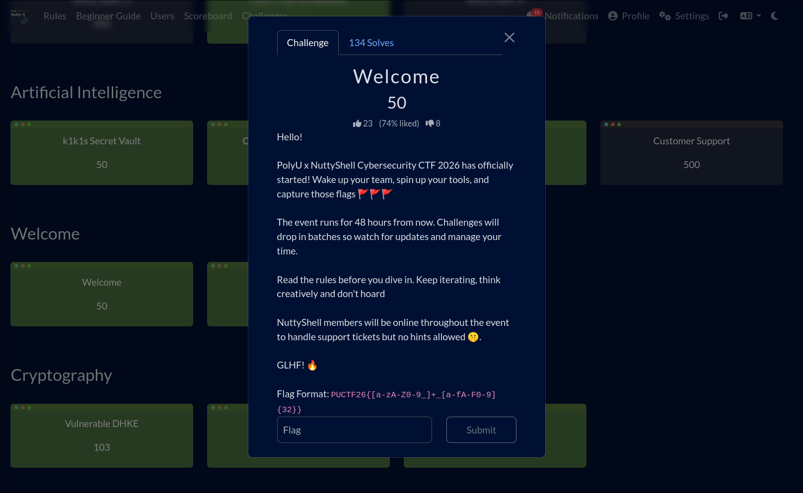
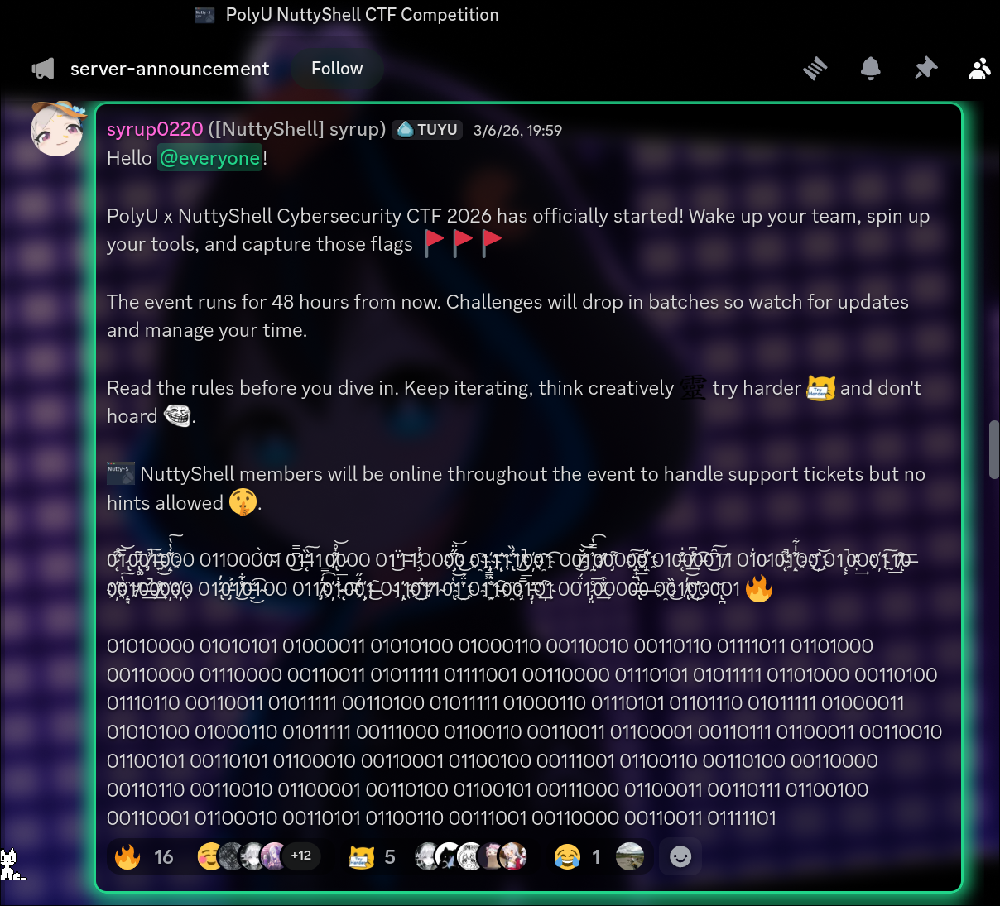

# Welcome

The challenge description didn't contain anything resembling a flag. Based on my CTF experience and intuition:

- The flag is rarely provided upfront in the main text.
- It is often released later or hidden in meta-locations.
- The Discord server is a prime spot for these types of clues.



## Discord Server

I headed over to the Discord server and checked the announcement channel.

The path was straightforward. I found a binary string and decided to use a quick Python one-liner to decode it:



```shell
echo "01010000 01010101 01000011 01010100 01000110 00110010 00110110 01111011 01101000 00110000 01110000 00110011 01011111 01111001 00110000 01110101 01011111 01101000 00110100 01110110 00110011 01011111 00110100 01011111 01000110 01110101 01101110 01011111 01000011 01010100 01000110 01011111 00111000 01100110 00110011 01100001 00110111 01100011 00110010 01100101 00110101 01100010 00110001 01100100 00111001 01100110 00110100 00110000 00110110 00110010 01100001 00110100 01100101 00111000 01100011 00110111 01100100 00110001 01100010 00110101 01100110 00111001 00110000 00110011 01111101" | python3 -c "import sys; print(''.join(chr(int(b, 2)) for b in sys.stdin.read().split()))" 
PUCTF26{h0p3_y0u_h4v3_4_Fun_CTF_8f3a7c2e5b1d9f4062a4e8c7d1b5f903}
```

Flag: `PUCTF26{h0p3_y0u_h4v3_4_Fun_CTF_8f3a7c2e5b1d9f4062a4e8c7d1b5f903}`
